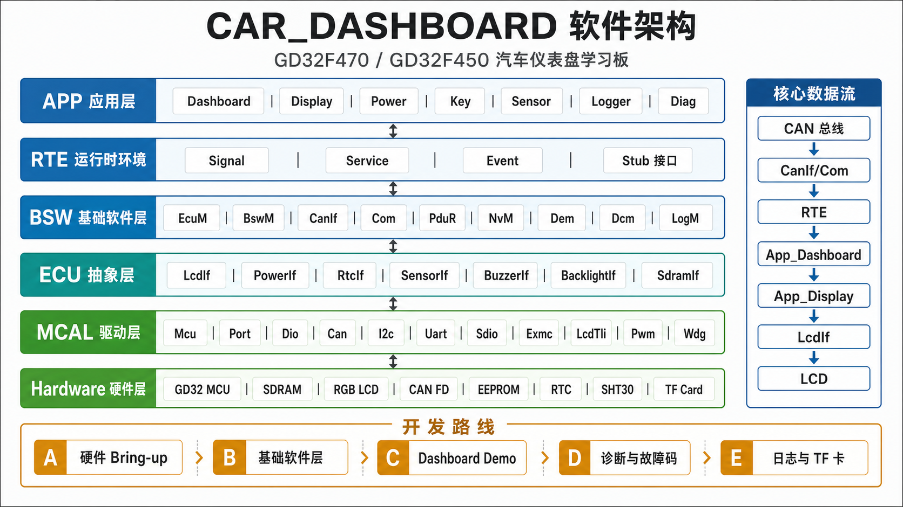

# CAR_DASHBOARD

基于 GD32F470ZGT6 / GD32F450ZGT6 的汽车仪表盘学习板工程。

本项目目标不是实现完整商用 AUTOSAR，而是基于 AUTOSAR Classic 的分层思想，搭建一个适合学习、调试、硬件验证和后续扩展的轻量化汽车仪表盘软件架构。

当前项目仍在开发中，PCB 一版板级测试已经完成，电源、串口、SDRAM、LCD、CAN、I2C、EEPROM、RTC、SHT30、TF 卡、按键蜂鸣器和整板 Demo 均已跑通。当前重点已经从“硬件 bring-up”切换到“正式软件架构 + FreeRTOS 任务化运行”的稳定性验证。

## 项目定位

本项目用于学习和验证以下内容：

- GD32F470 / GD32F450 MCU 工程开发
- 汽车仪表盘硬件 bring-up
- CAN 通信与仪表数据解析
- RGB LCD 显示与 SDRAM framebuffer
- EEPROM / RTC / SHT30 / TF 卡等外设调试
- 基于 AUTOSAR Classic 思想的软件分层
- MCAL / BSW / RTE / APP 的职责划分
- 后续诊断、故障码、参数存储和日志功能扩展

项目当前更偏向教学型 ECU / 学习板，不适合直接用于量产车辆或安全相关场景。

## 当前状态

- 已创建 GD32F470ZGT6 汽车仪表盘工程模板。
- 已建立 `App` / `Rte` / `Bsw` / `Mcal` / `Os` / `Config` / `Stub` / `Test` 目录。
- 已加入 GD32F4xx CMSIS、标准外设库和 USB 库。
- 已创建 Keil MDK 工程文件。
- 已完成 12 个分阶段板级测试，硬件通路确认可用。
- `main.c` 已切换为正式架构入口，只调用 `EcuM_Init()` 和 `EcuM_MainLoop()`。
- 已完成第一版 Mini AUTOSAR-like 主线：`EcuM -> BSW/RTE -> APP`。
- 已移植 FreeRTOS，当前默认开启拆分任务模式：`CanTask`、`AppFastTask`、`DisplayTask`、`SensorTask`、`NvMTask`、`LoggerTask` 和 `EcuM` 生命周期任务。
- 已给 RTE 全局信号、I2C0 总线、NvM/Dem 保存路径补充临界区或 mutex，降低任务拆分后的共享资源竞争风险。
- 已补齐当前教学版 CAN 矩阵：`0x321~0x324` 输入解析，`0x325~0x328` 仪表输出，`0x440` 简化 NM，`0x700/0x708` 诊断。
- LCD 已升级为定制仪表盘界面，显示左右表盘、中央车速/档位、CAN/SIM 状态、告警灯、燃油、水温、电压、RTC、座舱温湿度和 TPMS。

## 当前版本命名

当前建议命名为：

```text
v0.4.0-rtos-split-dashboard
```

版本代号：`RTOS Split Dashboard`

这个名字对应当前状态：硬件 bring-up 已完成，正式 Mini AUTOSAR-like 主线已落地，FreeRTOS 从单 `EcuM` 主任务升级为多任务拆分，Dashboard UI、CAN、UDS、Dem、NvM、RTC/SHT30/TPMS 等功能已经形成可演示闭环。

## 2026-06-03 至 2026-06-05 架构落地功能

本轮把之前 `Test/12_dashboard_demo` 的整板联调能力，拆分进正式分层架构：

```text
CAN 总线
  ↓
CanIf
  ↓
PduR
  ├─ Com -> RTE Signal -> App_Dashboard -> App_Display -> LcdIf
  └─ CanTp -> Dcm -> Dem / NvM
```

已实现内容：

- `EcuM`：负责早期 `PWR_HOLD` 自锁、启动初始化顺序、RUN 状态周期调度、长按电源键关机保存。
- `Os`：默认创建 FreeRTOS 拆分任务；`APP_CFG_FREERTOS_SPLIT_TASKS=0u` 可回退到单 `EcuM` 主任务，`APP_CFG_USE_FREERTOS=0u` 可回退到裸机 super loop。
- `RTE`：提供车速、转速、油量、水温、电压、RTC、温湿度、按键、背光、蜂鸣器、报警状态等信号接口。
- `CanIf / CanTrcv / CanSM`：封装 CAN1 500K 初始化、标准帧收发、SIT1043QT EN/STB_N/ERR_N 控制和基础通信状态。
- `PduR / Com`：按 CAN ID 路由，解析 `0x321/0x322/0x323/0x324`，并周期或事件发送 `0x325/0x326/0x327/0x328/0x440`。
- `CanTp / Dcm`：实现教学版 UDS 单帧诊断，支持 `0x10`、`0x22`、`0x19`、`0x14`、`0x3E`。
- `Dem`：实现 20 个 DTC 的状态、确认位、报警灯位、发生次数、清故障和按状态掩码查询。
- `NvM`：用 FT24C16A EEPROM 保存启动次数、系统配置和 DTC 状态，每个块带 magic/version/length/CRC16。
- `SdramMgr / SdramIf`：封装已验证的 EXMC SDRAM 初始化和 framebuffer 地址。
- `LcdIf / BacklightIf`：封装 LCD 初始化、局部矩形刷新、文本绘制和背光开关/亮度接口。
- `App_Dashboard`：处理 KEY1 模拟模式、KEY2 静音、KEY3 清零、超速/高转速报警和蜂鸣器控制。
- `App_Display`：周期刷新 LCD 主界面，显示车速、转速、档位、CAN 状态、RTC、温湿度、TPMS、报警/静音状态。
- `App_Sensor`：周期读取 DS3231 和 SHT30，并把通信失败/时间非法写入 Dem。
- `App_Logger`：周期输出 heartbeat，并通过 `0x328` 上报教学版日志状态和运行秒数。

本轮 Keil 命令行构建已通过核心编译链接流程，生成 `CAR_DASHBOARD.hex`。构建命令：

```powershell
D:\Keil5\UV4\UV4.exe -b D:\MCU\Project\car\CAR_DASHBOARD\Project\CAR_DASHBOARD.uvprojx -j0 -o D:\MCU\Project\car\CAR_DASHBOARD\Project\Objects\codex_build.log
```

## 2026-06-03 至 2026-06-04 FreeRTOS 移植状态

本轮已把 `D:\MCU\FreeRTOSv202212.01\FreeRTOS\Source` 中的最小内核源码移入工程，当前选择：

- Cortex-M4F Keil/RVDS 端口：`Os/FreeRTOS/Source/portable/RVDS/ARM_CM4F`
- 动态内存管理：`heap_4.c`
- 配置文件：`Config/FreeRTOSConfig.h`
- 兼容旧路径：`Os/FreeRTOSConfig.h` 只转发到 `Config/FreeRTOSConfig.h`
- 默认开关：`Config/App_Cfg.h` 中 `APP_CFG_USE_FREERTOS=1u`
- 任务拆分开关：`Config/App_Cfg.h` 中 `APP_CFG_FREERTOS_SPLIT_TASKS=1u`

当前默认运行在 FreeRTOS 拆分任务模式。通信栈仍放在同一个 `CanTask` 内串行运行，避免 `CanIf/Com/Dcm/CanTp` 并发访问；应用快任务、显示、传感器、NvM/Dem、日志和生命周期管理分开调度。若需要排查问题，可把 `APP_CFG_FREERTOS_SPLIT_TASKS` 改为 `0u` 回退到单 `EcuM` 主任务。

板上启动后串口应能看到：

```text
EcuM enter RUN, FreeRTOS enabled
Os creating split FreeRTOS tasks
```

若需要排查 RTOS tick、任务栈或中断优先级问题，可以临时把 `APP_CFG_USE_FREERTOS` 改为 `0u`，工程会回退到裸机 super loop，便于对比定位。

## 当前测试方法

1. 用 Keil 打开 `Project/CAR_DASHBOARD.uvprojx`，全量 Rebuild。
2. 烧录 `Project/Objects/CAR_DASHBOARD.hex`。
3. 打开串口 `115200 8N1`，上电后应看到 `CAR_DASHBOARD architecture main start`、`NvM init ok`、`Dem init ok`、`EcuM enter RUN, FreeRTOS enabled`、`Os creating split FreeRTOS tasks` 等日志。
4. LCD 应显示正式 Dashboard 主界面，而不是旧的测试 Demo 入口。
5. PCAN/USB-CAN 使用标准帧、500K，周期发送 `0x321`，DLC=8：

```text
100km/h、3000rpm 示例：
CAN ID: 0x321
Data  : 40 06 E0 2E C8 5A 41 78

解释：
VehicleSpeed raw=0x0640，乘 0.0625 = 100km/h
EngineSpeed  raw=0x2EE0，乘 0.25   = 3000rpm
Fuel raw=0xC8，乘 0.4 = 80%
Coolant raw=0x5A，减 40 = 50C
Outdoor raw=0x41，减 40 = 25C
Battery raw=0x78，当前按 0.1V/bit = 12.0V
```

6. 诊断请求走 `0x700`，响应看 `0x708`。推荐先发 ISO-TP 单帧：

```text
进入扩展会话：02 10 03 00 00 00 00 00 -> 03 50 03 00 32 13 88 00
TesterPresent：02 3E 00 00 00 00 00 00 -> 02 7E 00 00 00 00 00 00
读车速 DID ：03 22 F1 81 00 00 00 00 -> 05 62 F1 81 xx xx 00 00
读 DTC 数量：03 19 01 FF 00 00 00 00 -> 05 59 01 FF 00 nn 00 00
清全部 DTC ：04 14 FF FF FF 00 00 00 -> 01 54 00 00 00 00 00 00
```

7. 按键测试：

```text
KEY1：切换模拟车速/转速
KEY2：静音/恢复蜂鸣器
KEY3：清零当前仪表值
长按 KEY_POWER：保存 NvM/Dem 后拉低 PWR_HOLD 关机
```

## 硬件概览

第一版硬件规划包含：

| 模块 | 器件 / 功能 |
|---|---|
| MCU | GD32F470ZGT6 / GD32F450ZGT6 |
| 外部存储 | W9825G6KH-6I SDRAM，32MB |
| 显示 | 4.3 寸 RGB565 LCD |
| CAN | SIT1043QT CAN FD 收发器 |
| 电源 | 12V 输入，MP9486A 转 5V / 3.3V |
| 上电控制 | 船型开关强制上电 + 软开关自锁 |
| RTC | DS3231 + CR1220 后备电池 |
| EEPROM | FT24C16A |
| 传感器 | SHT30 温湿度传感器 |
| 存储扩展 | TF / microSD 卡接口 |
| 人机接口 | 用户按键、蜂鸣器、状态指示灯 |
| 调试 | SWD + UART |

## 关键引脚规划

| 功能 | MCU 引脚 |
|---|---|
| KEY_POWER | PC13 |
| PWR_HOLD | PE3 |
| CAN1_TX | PB13 |
| CAN1_RX | PB12 |
| CAN1_EN | PB14 |
| CAN1_STBN | PB15 |
| CAN1_ERR_N | PG3 |
| I2C0_SCL | PB6 |
| I2C0_SDA | PB7 |
| SDIO_D0 | PC8 |
| SDIO_D1 | PC9 |
| SDIO_D2 | PC10 |
| SDIO_D3 | PC11 |
| SDIO_CLK | PC12 |
| SDIO_CMD | PD2 |
| KEY1 | PF6 |
| KEY2 | PF7 |
| KEY3 | PF8 |
| BUZZER_CTRL | PF9 |

## 软件架构

项目采用轻量 AUTOSAR-like 分层设计：



```text
┌────────────────────────────────────┐
│ APP                                │
│ Dashboard / Display / Power / ...  │
├────────────────────────────────────┤
│ RTE                                │
│ Signal / Service / Event           │
├────────────────────────────────────┤
│ BSW                                │
│ Services / Communication / Memory  │
│ ECU Abstraction                    │
├────────────────────────────────────┤
│ MCAL                               │
│ Mcu / Port / Dio / Can / I2c / ... │
├────────────────────────────────────┤
│ Hardware                           │
│ GD32 + SDRAM + LCD + CAN + I2C     │
└────────────────────────────────────┘
```

核心原则：

- APP 不直接操作寄存器
- APP 不直接访问 CAN、EEPROM、LCD 等底层驱动
- 业务逻辑尽量通过 RTE 读写信号或调用服务
- MCAL 只负责 MCU 外设和硬件资源
- BSW 负责通信、存储、诊断、电源、抽象接口等基础服务
- 当前默认运行在 FreeRTOS 拆分任务模式；需要隔离 RTOS 变量时可回退到单 `EcuM` 任务或裸机 super loop

更完整的软件架构和功能架构梳理见 `Docs/软件架构与功能架构.md`。

## 目录结构

```text
CAR_DASHBOARD/
├── App/                 # 应用层：仪表、显示、电源、按键、传感器、日志等
├── Bsw/                 # 基础软件层
│   ├── Communication/   # CanIf、CanTp、Com、PduR、CanSM、CanTrcv、UartIf
│   ├── EcuAbstraction/  # LcdIf、PowerIf、RtcIf、SensorIf、BuzzerIf 等
│   ├── Memory/          # Eep、MemIf、NvM 相关存储抽象、SD/FATFS、SDRAM
│   └── Services/        # EcuM、BswM、Dem、Dcm、NvM、Crc、LogM、Det
├── Config/              # 模块配置头文件
├── Firmware/            # GD32F4xx CMSIS、标准外设库、USB 库
├── Mcal/                # MCU 抽象层驱动
├── Os/                  # FreeRTOS 适配、任务创建、临界区和 mutex 抽象
├── Project/             # Keil MDK 工程文件
├── Rte/                 # 运行时环境接口
├── Stub/                # 无硬件时的模拟输入/输出
├── Test/                # 分阶段硬件测试程序
├── Docs/                # 架构、测试、调试和答辩文档
├── c语言语法学习.md    # 本工程涉及的 C 语言语法学习笔记
├── main.c               # 当前最小入口
└── 进度.md              # 开发记录
```

## 测试程序规划

收到 PCB 后建议按以下顺序逐步焊接和验证，每个测试程序尽量保持独立可运行：

| 顺序 | 测试目录 | 目标 |
|---|---|---|
| 01 | `Test/01_power_hold_test` | 验证 KEY_POWER、PWR_HOLD、船型开关 BYPASS |
| 02 | `Test/02_uart_led_test` | 验证最小系统、时钟、UART、LED |
| 03 | `Test/03_sdram_test` | 验证 EXMC SDRAM 初始化和读写 |
| 04 | `Test/04_lcd_color_test` | 验证 RGB LCD、背光、纯色和色条显示 |
| 05 | `Test/05_can_loop_test` | 验证 CAN 收发器和 USB-CAN 通信 |
| 06 | `Test/06_i2c_scan_test` | 扫描 EEPROM、RTC、SHT30 等 I2C 设备 |
| 07 | `Test/07_eeprom_test` | 验证 EEPROM 读写和掉电保存 |
| 08 | `Test/08_rtc_test` | 验证 DS3231 走时和后备电池 |
| 09 | `Test/09_sht30_test` | 验证温湿度读取 |
| 10 | `Test/10_tf_card_test` | 验证 SDIO、FATFS、文件读写 |
| 11 | `Test/11_key_buzzer_test` | 验证按键、长按检测和蜂鸣器 |
| 12 | `Test/12_dashboard_demo` | 综合仪表 Demo：CAN 数据 + LCD 显示 + 报警 |

## 上电与焊接原则

PCB 回来后不要一次性焊满、一次性上电。推荐流程：

1. 裸板目检和电源网络阻值检查
2. 只焊输入保护与电源接口
3. 焊船型开关和软开关自锁电路
4. 焊 5V DCDC 并限流测试
5. 焊 3.3V DCDC 并限流测试
6. 焊 MCU 最小系统、SWD、UART
7. 焊 SDRAM 并单独测试
8. 焊 LCD 和背光并单独测试
9. 焊 CAN 模块并单独测试
10. 焊 EEPROM / RTC / SHT30 并进行 I2C 扫描
11. 焊 TF 卡、按键、蜂鸣器等扩展模块
12. 最后进行系统联调和长时间稳定性测试

首次上电必须使用可调电源限流，并优先确认 `12V_SYS`、`5V_SYS`、`3V3_SYS` 是否正常。

## 当前 CAN 信号

当前正式架构已不再使用旧 Demo 的 `0x100/0x101`。教学版 CAN 矩阵如下：

| CAN ID | 方向 | 周期 / 触发 | 当前状态 |
|---|---|---|---|
| `0x321` | 外部 ECU/PCAN -> 仪表 | 20ms | 已解析车速、转速、油量、水温、外温、电压 |
| `0x322` | 外部 ECU/PCAN -> 仪表 | 100ms | 已解析点火、档位和告警灯位 |
| `0x323` | 外部 ECU/PCAN -> 仪表 | 1000ms | 已解析四轮胎压和胎温，并在 LCD 显示 |
| `0x324` | 外部 ECU/PCAN -> 仪表 | 500ms | 已解析主题、语言、单位、背光、音量、续航和外部时间 |
| `0x325` | 仪表 -> 总线 | 100ms | 周期发送车速、转速、报警、静音、模拟模式和动力 CAN 有效位 |
| `0x326` | 仪表 -> 总线 | 1000ms | 周期发送 DTC 数量、诊断会话和动力 CAN 有效位 |
| `0x327` | 仪表 -> 总线 | 按键事件 | KEY1/KEY2/KEY3 触发时发送用户输入事件 |
| `0x328` | 仪表 -> 总线 | 1000ms | 周期发送教学版日志状态和运行秒数 |
| `0x440` | 仪表 -> 总线 | 1000ms | 简化 NM/RUN 状态心跳 |
| `0x700/0x708` | Tester <-> 仪表 | 按需 | 教学版 UDS 单帧物理请求和响应 |
| `0x7DF` | Tester -> 仪表 | 按需 | 教学版 UDS 功能寻址请求 |

当前业务数据流：

```text
CAN 总线
  ↓
MCAL Can
  ↓
CanIf / Com
  ↓
RTE Signal
  ↓
App_Dashboard / App_Display
  ↓
LcdIf / BacklightIf / BuzzerIf
```

## 开发路线

### 阶段 A：硬件 Bring-up

- 电源、PWR_HOLD、UART、LED
- SDRAM
- LCD
- CAN
- I2C 外设

### 阶段 B：基础软件层

- MCAL 基础驱动
- CanIf / CanTrcv / Com 简化版
- LcdIf / PowerIf / RtcIf / SensorIf
- Eep / NvM 简化版
- RTE 信号接口

### 阶段 C：Dashboard Demo

- USB-CAN 模拟车速 / 转速
- LCD 显示车速 / 转速
- 超限蜂鸣器报警
- RTC 显示时间
- SHT30 显示温湿度
- EEPROM 保存配置

### 阶段 D：诊断与故障码

- Dem 故障事件记录
- Dcm 基础 UDS 服务
- CanTp 多帧传输
- 通过 USB-CAN 读取 DID / DTC

### 阶段 E：日志与 TF 卡

- TF 卡挂载 FATFS
- 运行日志和故障日志
- 长时间运行数据记录

## 当前构建方式

当前工程主要面向 Keil MDK：

```text
Project/CAR_DASHBOARD.uvprojx
```

推荐流程：

1. 用 Keil MDK 打开 `Project/CAR_DASHBOARD.uvprojx`。
2. 确认 `Config/App_Cfg.h` 中 `APP_CFG_USE_FREERTOS=1u`，`APP_CFG_FREERTOS_SPLIT_TASKS=1u`。
3. 全量 Rebuild，生成 `Project/Objects/CAR_DASHBOARD.hex`。
4. 烧录后通过串口、LCD、PCAN 和 UDS 请求验证运行状态。

最近一次记录的拆分任务版本构建日志为 `Project/Objects/codex_task_split_build.log`，结果为 `0 Error(s), 0 Warning(s)`。

## 注意事项

- `PWR_HOLD` 必须在启动早期尽快拉高，否则软开关模式下可能刚启动就断电
- LCD 调试前必须先确认 SDRAM 和背光
- CAN 调试前必须确认收发器 `EN` / `STBN` 状态
- I2C 调试建议先做总线扫描，再逐个验证 EEPROM、RTC、SHT30
- EEPROM 不要高频写入，后续应通过 NvM 做延迟写和 CRC 校验
- TF 卡和日志功能不影响第一阶段主功能，可放到后面
- FreeRTOS 当前默认拆分任务，若出现 LCD、I2C、EEPROM 或 RTE 相关异常，先回退 `APP_CFG_FREERTOS_SPLIT_TASKS=0u` 做对比

## 进度记录

开发进度请继续记录到：

```text
进度.md
```

每次新增模块、调通测试、发现硬件问题或确认第二版 PCB 修改点，都建议追加记录，方便后续复盘。

## 2026-06-03 架构落地状态

PCB 板级硬件通路已完成第一轮验证，工程已从 `12_dashboard_demo` 测试闭环切换到正式 Mini AUTOSAR-like 主线。

已落地功能：

- `main.c` 只保留入口，启动流程交给 `EcuM_Init()`，运行调度交给 `Os_Start()`。
- `EcuM` 管理上电自锁、初始化顺序、自检状态、RUN 状态和周期调度。
- `Os` 默认使用 FreeRTOS 拆分任务运行；`APP_CFG_FREERTOS_SPLIT_TASKS=0u` 可回退到单 `EcuM` 任务，`APP_CFG_USE_FREERTOS=0u` 可回退到裸机 super loop。
- `CanIf/CanTrcv/PduR/CanTp/Com` 已形成 CAN 通信主线。
- `RTE` 已提供车速、转速、电压、RTC、温湿度、按键、蜂鸣器、CAN 有效性等信号。
- `Dcm` 支持教学级 UDS 单帧服务：`0x10`、`0x22`、`0x19`、`0x14`、`0x3E`。
- `Dem` 已对齐第一版 DTC 表，支持故障状态、发生次数、DTC 数量和首个 DTC 查询。
- `NvM` 使用 FT24C16A EEPROM 保存启动次数、系统配置和 Dem 状态，并增加 CRC16 校验。
- `App_Display` 通过 `LcdIf` 做局部刷新，避免频繁整屏重画导致 SDRAM/TLI 抢带宽。

新增文档：

- `Docs/架构落地调试记录.md`
- `Docs/知识点梳理_HR答辩.md`
- `Docs/架构版测试步骤.md`
- `Docs/软件架构与功能架构.md`
- `c语言语法学习.md`
